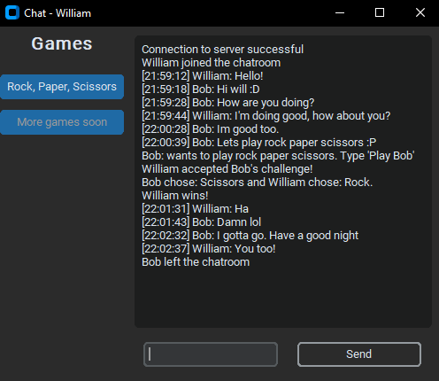
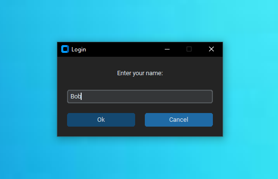
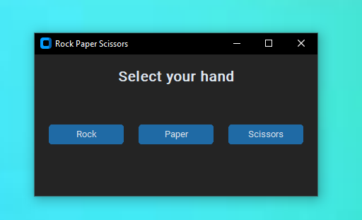

<!-- PROJECT LOGO -->
<br />
<div align="center">
  <a href="https://github.com/bennettbDEV/ChatApp">
    
  </a>

<h3 align="center">Python TCP Chatapp</h3>

  <p align="center">
    A simple chatting application with encryption, a modern GUI, and a game for users to play.
    <br />
    <br />
    <a href="https://github.com/bennettbDEV/ChatApp/issues/new?labels=bug&template=bug-report---.md">Report Bug</a>
    ·
    <a href="https://github.com/bennettbDEV/ChatApp/issues/new?labels=enhancement&template=feature-request---.md">Request Feature</a>
  </p>
</div>

<!-- ABOUT THE PROJECT -->
## About The Project

<div align="center">
  <a>
    
  </a>
</div>

After taking a networking course, I was motivated to put my newly gained knowledge to use and actually make something. 
Due to its widespread use and ease to write, I chose to code in Python and use TCP sockets to implement a server-client
model, where most of the chat and game logic is performed by the server. The server (currently) doesn't need any input and simply prints chat logs to the console.
The client on the other hand has a complete UI, with additional windows for entering a name and choosing an option for Rock Paper Scissors.

<br />

<div align="center">
  <a>
          
  </a>
</div>

  
### Built With

* <a href="https://github.com/TomSchimansky/CustomTkinter">CustomTkinter</a>
* <a href="https://github.com/sybrenstuvel/python-rsa">Python-RSA</a>


<!-- GETTING STARTED -->
## Setup

To set the server/client up follow these simple example steps.

0. (Optionally) Set up a [virtual environment](https://www.freecodecamp.org/news/how-to-setup-virtual-environments-in-python/)
```sh
python<version> -m venv <virtual-environment-name>
```
2. Clone the repo
```sh
git clone https://github.com/bennettbDEV/ChatApp.git
```
3. Install necessary packages
```sh
python -m pip install -r requirements.txt
```
4a. To start the server, change the host and port values on line 8-9 to whatever you would like and run **serverHost.py**

4b. To start the client, change the host and port values on line 8-9 to a known server address + port and run **client.py** 

<!-- CONTACT -->
## Contact

Bennett B. - bennettbeltran1@gmail.com - [Linkedin](https://linkedin.com/in/bennettbeltran)


<!-- ACKNOWLEDGMENTS -->
## Acknowledgments
While developing this app, I watched videos from NeuralNine and Atlas to better understand networking and UI development (for python) respectively, so I recommend checking them out.
* [NeuralNine](https://www.youtube.com/@NeuralNine)
* [Atlas](https://youtube.com/playlist?list=PLpMixYKO4EXeaGnqT_YWx7_mA77bz2VqM&si=LXwmlks4OqyhAUtU)
* [README-Template](https://github.com/othneildrew/Best-README-Template)

<p align="right">(<a href="#readme-top">back to top</a>)</p>


<!-- MARKDOWN LINKS & IMAGES -->
<!-- https://www.markdownguide.org/basic-syntax/#reference-style-links -->
[contributors-shield]: https://img.shields.io/github/contributors/bennettbDEV/ChatApp.svg?style=for-the-badge
[contributors-url]: https://github.com/bennettbDEV/ChatApp/graphs/contributors
[forks-shield]: https://img.shields.io/github/forks/bennettbDEV/ChatApp.svg?style=for-the-badge
[forks-url]: https://github.com/bennettbDEV/ChatApp/network/members
[stars-shield]: https://img.shields.io/github/stars/bennettbDEV/ChatApp.svg?style=for-the-badge
[stars-url]: https://github.com/bennettbDEV/ChatApp/stargazers
[issues-shield]: https://img.shields.io/github/issues/bennettbDEV/ChatApp.svg?style=for-the-badge
[issues-url]: https://github.com/bennettbDEV/ChatApp/issues
[license-shield]: https://img.shields.io/github/license/bennettbDEV/ChatApp.svg?style=for-the-badge
[license-url]: https://github.com/bennettbDEV/ChatApp/blob/master/LICENSE.txt
[linkedin-shield]: https://img.shields.io/badge/-LinkedIn-black.svg?style=for-the-badge&logo=linkedin&colorB=555
[linkedin-url]: https://linkedin.com/in/bennettbeltran
[chatp2-screenshot]: images/chatp2.png
